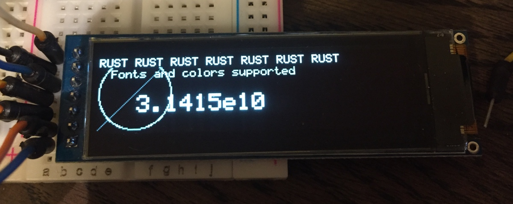

# SH1122 OLED display driver

Pure Rust driver for the SH1122 OLED display chip, for use with
[embedded-hal](https://crates.io/crates/embedded-hal).

## Description

This driver is intended to work on embedded platforms using the `embedded-hal`
trait library. It is `no_std`, contains no added `unsafe`, and does not require
an allocator. The initial release supports the 4-wire SPI interface.

Includes rudimentary support for [embedded-graphics](https://github.com/jamwaffles/embedded-graphics).

### Missing features:

- Proper [embedded-graphics](https://github.com/jamwaffles/embedded-graphics)
  `Drawing` support.
- Tests
- An example
- Support full command list

## Acknowledgements

[edarc/ssd1322](https://github.com/edarc/ssd1322) for the SSD1322 driver
I forked to make this one.  
[jamwaffles/ssd1306](https://github.com/jamwaffles/ssd1306) for internal design
inspiration.  
[japaric/embedded-hal](https://github.com/japaric/embedded-hal) for making
dealing with embedded hardware easy, safe, and enjoyable.

## License

Licensed under either of

- Apache License, Version 2.0 (http://www.apache.org/licenses/LICENSE-2.0)
- MIT license (http://opensource.org/licenses/MIT)

at your option.

### Contribution

Unless you explicitly state otherwise, any contribution intentionally submitted
for inclusion in the work by you, as defined in the Apache-2.0 license, shall
be dual licensed as above, without any additional terms or conditions.
